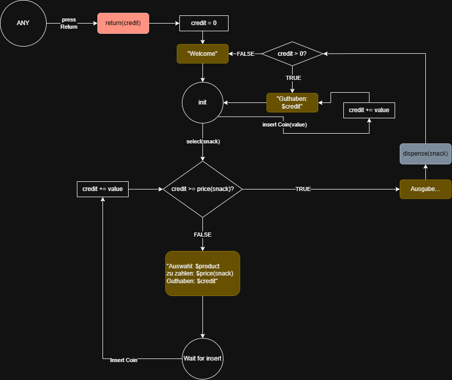

# Projekt-Architektur

Aufteilung in 3 Hauptlayer:

- Frontlayer
  - Reine UI/ Darstellung
    - Seiten und Widgets
    - Darstellung von Modellen und Werten 
      - zB. price = 3.5 darstellen als '€ 3,50'
    - Themedata
- Midlayer
  - Sämtliche Logik
    - Modellklassen
    - Provider/ Notifier
    - Utility-Funktionen
- Backlayer
  - Datenspeicherung
  - Kommunikation mit DB etc.
  - Reines sperichern und laden, keine Logik!

# Ordnerstruktur (lib)
- lib
    - front_layer
      - widgets
        => einzelne Widgets (zB. Snack- Item, Zahlenpad, etc.)
      - views
        => vollständige Seiten (zB Automaten-Ansicht, Admin-Ansicht)
    - mid-layer
      - models
      - states?
      - notifiers
      - providers.dart
      - weitere logik...
    - back_layer
      - DatabaseService
  - main.dart

...
# User Interface

- Snackraster
  - Matrix mit Slots für die Einzelnen Snacks
  - In jedem Slot passt ein Stapel von Snacks, bei Ausgabe Fallanimation
  - Preisschild für Snack
  - Nummer von Snack für Bedienfeld
- Bedienfeld
  - Nummernblock zur Auswahl der Snacknummer
  - Abbrechen Knopf
  - Knopf zum bestätigen
  - Kleiner Screen mit Infos wie aktuellem Geldtand und Ausgaben für Admin
- Geldeingabe
  - Schlitz für Scheine
  - Schlitz für Münzen
  - Geld zurück Knopf
  - Ausgabefach für Geldrückgabe    
- Ausgabefach für Snacks

# Datenbank
Datenbank speichert folgende Dinge:
- Anzahl der Snacks pro Slot
- Preis der Snacks
- Alle Transaktionen
- Wie viel Geld in dem Automaten ist auch jeweils wie viele Münzen oder Scheine

# Prinzipieller Dataflow:
(So in etwa)

Input via UI 
=> Midlayer (ML) wird informiert 
=> ML fragt entsprechende Daten von DB an, verarbeitet diese und gibt eventuelle Änderungen an DB zurück 
=> ML updatet states und informiert den Frontlayer

## Beispiel:
User drückt Taste für Snack 'Nuka Cola'
=> UI informiert Midlayer 'Nuka Cola Taste gedrückt'
=> ML fragt Daten über 'Nuka Cola' bei der DB an.
    => count: 3
    => price: 3.5
=> ML updated den State des Automaten-Displays
=> Display zeigt an: 'Gewähltes Produkt: Nuka Cola (verfügbar), Preis: € 3,50'

# States des Automaten:

